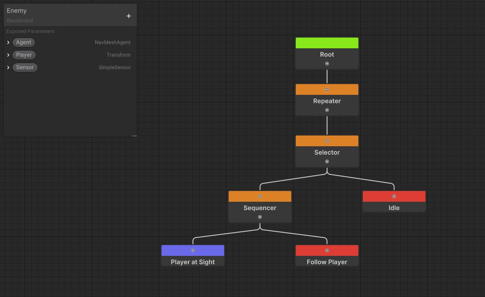
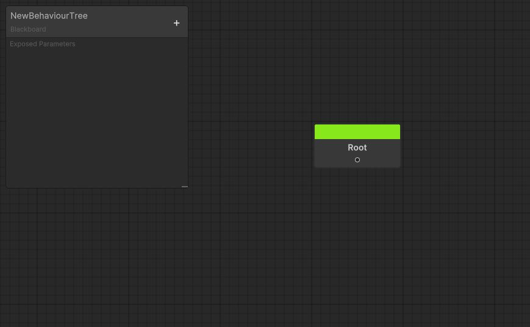
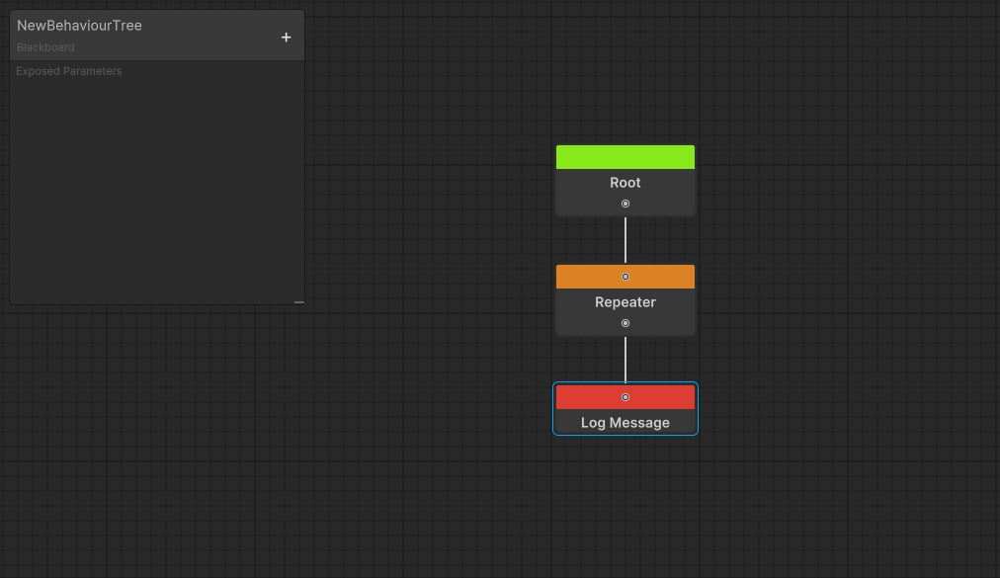
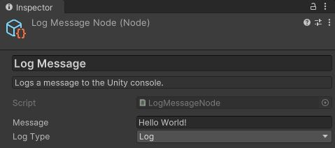
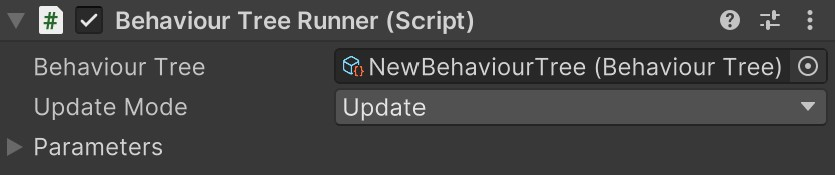
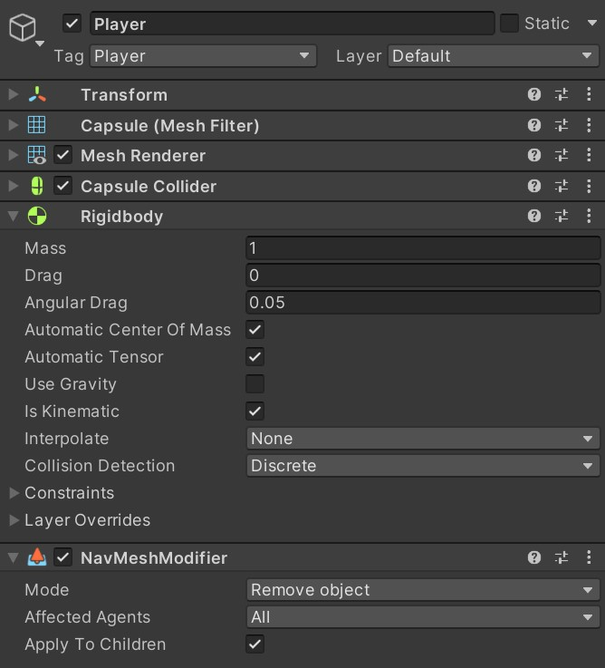
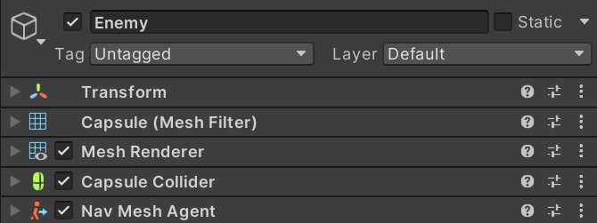
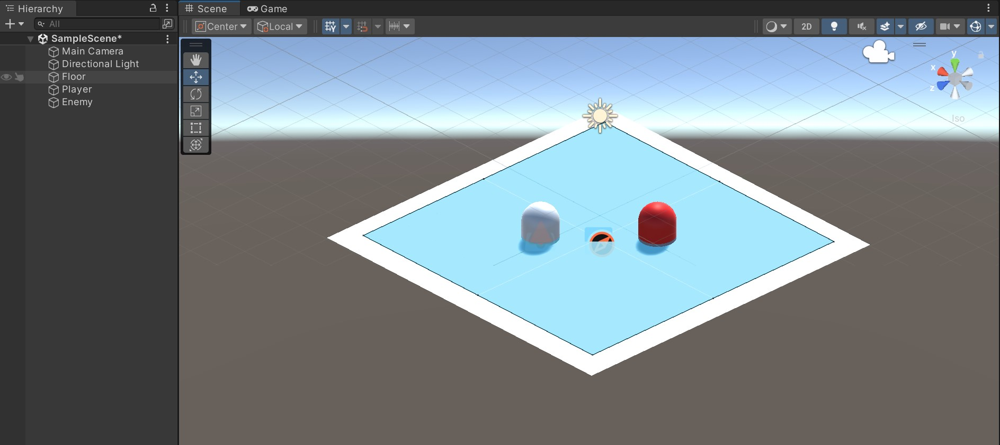
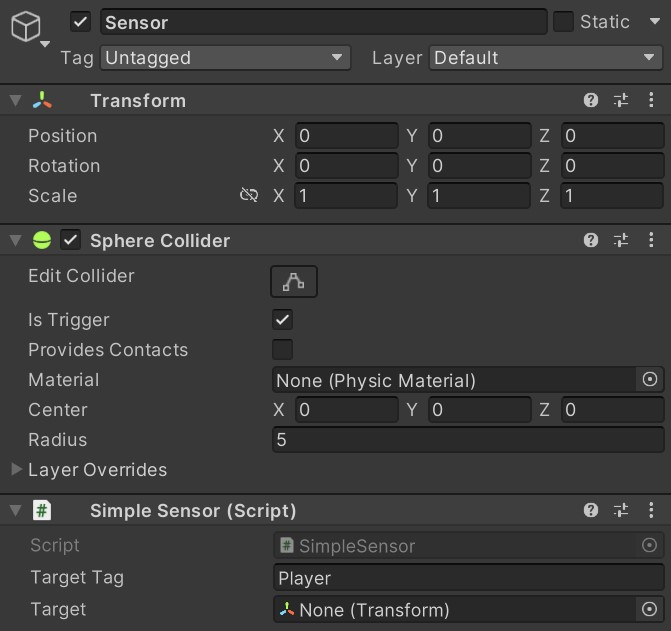
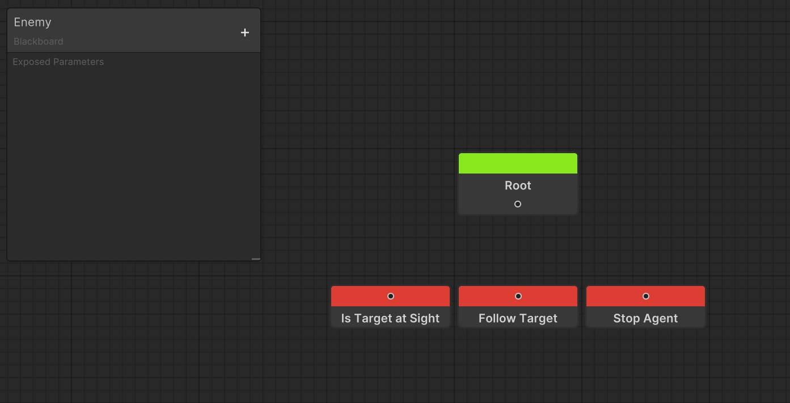

# AI Behaviour Tree

Behaviour Trees are an amazing way of creating AIs, letting you write complex behaviours in a modular, easy and intuitive way. This project tries to deliver a simple yet complete Behaviour Tree solution for Unity, with Editor and Runtime tools.

This README assumes that you have some idea of what a BehaviorTree is; If you don't, I suggest you Google it first.

> [!NOTE]
> The minimum version currently supported is **Unity 2022.2**

> [!WARNING]
> This project is in an early phase of development and although it is quite stable, you may encounter bugs and is **NOT** recommended for use in production.

## Table of Contents

1. [Features](#features)
2. [Installation](#installation)
3. [Getting Started](#getting-started)
    1. [Graph](#graph)
        - [Navigation](#navigation)
        - [Shortcuts](#shortcuts)
        - [Add Nodes](#add-nodes)
        - [Create Nodes](#create-nodes)
    2. [Runner](#runner)

## Features

- Graph Node Editor
- Blackboard Editor
- Blackboard Overrides
- Runtime Debugger

## Installation

> [!NOTE]
> At the moment, you can install this package ONLY through the **Package Manager** using **Git**.

First of all, we need to install a dependency called **METools**.

Open your Unity project, go to `Window > Package Manager` and click the `+` dropdown on the **top-left** corner, then select `Add package from git URL...` and paste the following URL:

```
https://github.com/MoshitinEncoded/METools.git
```

> [!NOTE]
> If you receive the error `No 'git' executable was found` you're likely missing a **git** installation. You can install **git** from here: https://git-scm.com/download/win

Once installed, do the same with this package:

```
https://github.com/MoshitinEncoded/AI-Behaviour-Tree.git
```

## Getting Started

AI Behavior Tree is mainly composed of a **ScriptableObject** called `BehaviourTree` and a **MonoBehaviour** called `BehaviourTreeRunner`.

Like Unity's `Animator`, the **ScriptableObject** contains the behavior while the **MonoBehaviour** is responsible for running it. Let's start by creating a `BehaviourTree` in our project.

1. Go to your project window and right-click to open the context menu or click the `+` button in the top left corner.
2. Select `Create > Moshitin Encoded > Behaviour Tree` and choose a name.
3. Double click on the **ScriptableObject** to edit it.

You will see that a new window has appeared, arrange it to your liking and let's see what it has:



*A blank BehaviourTree graph.*

As you can see it is super simple, on one hand we have the **Graph** and on the other the **Blackboard**.

### Graph

The Graph contains the tree of nodes and their connections. At first you will only have one default node called `Root`, which cannot be copied or deleted.

In each frame the tree begins its execution through the `Root` and then continues towards its child. When the child returns its state to the `Root`, it terminates the execution of the tree in that frame.

There are only 3 states that a node can return: `Success`, `Running` or `Failure`.

> [!IMPORTANT]
> Note that if the `Root` receives the status `Success` or `Failure`, it will stop the tree from running completely and you will need to restart it manually.

#### Navigation

| Action               | Control             |
| -------------------- | ------------------- |
| Pan                  | Middle-Click + Drag |
| Zoom                 | Mouse wheel scroll  |
| Select               | Left-Click          |
| Rect Select          | Left-Click + Drag   |
| Drag Selection       | Left-Click + Drag (over node)|
| Add/Remove Selection | Ctrl + Left-Click   |
| Open Contextual Menu | Right-Click         |

#### Shortcuts

| Action               | Shortcut            |
| -------------------- | ------------------- |
| Delete               | Del                 |
| Copy                 | Ctrl + C            |
| Paste                | Ctrl + V            |
| Duplicate            | Ctrl + D            |
| Focus Selection      | F                   |
| Focus All            | A                   |
| Create Node          | Spacebar            |

#### Create Nodes

Right click on the Graph and select `Create Node` or press the `Space` key on your keyboard to open the search window. Here you can search for any type of node that comes by default or that you have created yourself. Selecting any of these will add it to the graph of your BehaviourTree.

#### Create Custom Nodes

Creating your own node is very simple, you just have to create a script that inherits from a **node class** and add the `CreateNodeMenu` attribute on top of it.

##### Node Classes

At the moment there are 3 node classes you can inherit from:

| Node Class      | Description                                             |
| --------------- | ------------------------------------------------------- |
| `CompositeNode` | Has multiple childs. It is meant for flow control.      |
| `DecoratorNode` | Has only one child. It is meant for child/flow control. |
| `TaskNode`      | Does not have children. It is meant for logic.          |

> [!NOTE]
> If the compiler doesn't find the node classes, make sure you import these `namespaces` at the start of your script:
> ```CSharp
> using MoshitinEncoded.AI;
> using MoshitinEncoded.AI.BehaviourTreeLib;
> ```

##### CreateNodeMenu Attribute

Once you have created your class, you may notice that the `CreateNodeMenu` attribute requires a `path`. This parameter represents the submenu in the search window where your node will appear (e.g. "Task/Follow Target").

##### Functions

There are multiple functions that you can override to implement your node logic:

| Function       | When is called                                 |
| -------------- | ---------------------------------------------- |
| `Run`          | Every time your node runs.                     |
| `OnInitialize` | The first time your node starts running.  |
| `OnStart`      | When your node starts running.                 |
| `OnStop`       | When your node returns `Success` or `Failure`. |

### Blackboard

The Blackboard contains parameters that provide useful information to the nodes, allowing them to communicate with each other and with the components of the scene.

#### Add Parameters

In the editor do the following:

1. Press the `+` button in the upper right corner of the Blackboard.
2. Select the parameter type you want to add.
3. Double-click or `Right-Click > Rename` on the parameter to give it an appropriate name.

#### Get/Set Parameters

You can **Get** and **Set** parameters through the `BehaviourTreeRunner` functions:

- `GetParameter<>`
- `SetParameter<>`
- `GetParameterByRef`
- `GetParameterByRef<>`

If you want to know another way of getting and setting a parameter, read the [Optimizations](#optimization) section.

### First Steps

Now that you know the basics, let's start by creating an extremely simple BehaviourTree in order to show its most basic operation. This behaviour will log a message to the console each frame.

#### Adding Nodes

Right click on the Graph and select `Create Node` or press the `Space` key on your keyboard to open the search window. Here you can search for any type of node that comes by default or that you have created yourself.

Add the `Repeater` and `LogMessage` nodes, and connect them as follows:



The `Repeater` node is responsible for running its child node each frame, and the `LogMessage` node logs a message to the console each time it is executed.

Now select the `Log Message` node and write some nice message :smile:



Perfect! This will show us a message in the console every time the BehaviorTree is executed. Let's add it to the scene!

> [!IMPORTANT]
> The BehaviorTree does not save automatically, so be sure to save every once in a while.

#### Runner

Now that we have the `BehaviourTree` ready to use, it's time to get it up and running:

1. Create a GameObject in the scene and add the `BehaviourTreeRunner` component to it.
2. Assign the `BehaviourTree` we just created to it.



That's all! Hit **Play** and let's see what happens.

If the message you wrote appeared repeatedly on the console, congratulations, it means it works! But let's face it, you didn't install this package to print things via console. It's time to create an AI!

### Your First AI

Our AI will have a simple behavior: detect if the player is nearby and chase him. Otherwise, stay in place.

#### Scene

Let's start by setting the scene:

1. Add a Plane named "Floor" with the `NavMeshSurface` component and bake it.
2. Add a Capsule named "Player" with the following components:
    1. `Rigidbody` (with "Kinematic: enabled" and "UseGravity: disabled")
    2. `NavMeshModifier` (with "Mode: Remove Object"). This prevents the Player from being taken into account for the `NavMeshSurface` baking, in case you want to do it again.
3. Setup the Player tag to "Player" so we can identify him later on.
4. Add a Capsule named "Enemy" with a `NavMeshAgent` component.


*Floor inspector.*



*Player inspector.*



*Enemy inspector.*

Right now the Player and the Enemy look identical. To make it easier to distinguish them, we will add a red material to the Enemy:



*The new Hierarchy and Scene.*

Perfect! Now we only have one preparation left, we must create a script that detects when the Player is close to our enemy. So as not to bore you, here is the script you need (just use your legendary copy and paste skills):

```CSharp
using System.Collections.Generic;

using UnityEngine;

public class SimpleSensor : MonoBehaviour
{
    [SerializeField] private string _TargetTag;
    [SerializeField] private Transform _Target;

    public Transform Target => _Target;

    private void OnTriggerEnter(Collider other)
    {
        if (other.CompareTag(_TargetTag) && !_Target)
        {
            _Target = other.transform;
        }
    }

    private void OnTriggerExit(Collider other)
    {
        if (other.transform == _Target)
        {
            _Target = null;
        }
    }
}
```

Once you have it:

1. Add a new GameObject called "Sensor" as a child of the GameObject "Enemy".
1. Attach to it a `SphereCollider` with "Is Trigger: enabled" and "Radius: 5".
2. Attach to it the component we just created with "Target Tag: Player".



*Sensor inspector.*

Listo! Ya tenemos todos los preparativos para hacer nuestra IA, asi que pasemos al `BehaviourTree`.

#### BehaviourTree

Primero que nada, crea un nuevo `BehaviourTree` llamado `Enemy` en el que desarrollaremos nuestra IA. Para esto necesitaremos crear nuestros propios nodos, asi que vamos con ello.

##### Creating Nodes

Crear un nuevo nodo es muy simple, solo tienes que crear un script que herede de una **clase de nodo** y agregar el atributo `CreateNodeMenu` encima de la clase.

Por el momento hay 3 clases de nodo de las cuales puedes heredar: `CompositeNode`, `DecoratorNode` y `TaskNode`, siendo ésta última donde podrás implementar la lógica de las IA.

Para nuestra IA vamos a necesitar 3 nodos que hereden de `TaskNode` llamados `IsTargetAtSightNode`, `FollowTargetNode` y `StopAgentNode`.

`IsTargetAtSight` se encargará de revisar si el Player fue detectado por el Sensor, en caso afirmativo se ejecutará el nodo `FollowTargetNode` el cual hará que la IA siga al jugador, y en caso de que no fuera detectado se ejecutará el `StopAgentNode` que detendrá a la IA.

Comencemos creando el `TargetAtSightNode`.

1. Crea un script llamado `TargetAtSightNode`.
2. Haz que herede de `TaskNode`.
3. Implementa la clase abstracta.
4. Agrégale el atributo `CreateNodeMenu` a la clase.

> [!NOTE]
> Si el compilador no encuentra las clases de nodo, asegúrate de importar estos `namespace` al inicio de tu script:
> ```CSharp
> using MoshitinEncoded.AI;
> using MoshitinEncoded.AI.BehaviourTreeLib;
> ```

Notarás que el atributo te pedirá un **string** llamado `path`, éste representa el submenú en el que aparecerá cuando intentes añadir un nodo al grafo. Yo lo añadiré al submenú *"Task/Condition/Is Target at Sight"*, pero tú puedes añadirlo a donde quieras.

Debería quedarte de la siguiente forma:

```CSharp
using MoshitinEncoded.AI;
using MoshitinEncoded.AI.BehaviourTreeLib;

[CreateNodeMenu(path: "Task/Condition/Is Target at Sight")]
public class IsTargetAtSightNode : TaskNode
{
    protected override NodeState Run(BehaviourTreeRunner runner)
    {
        throw new System.NotImplementedException();
    }
}
```

> [!NOTE]
> Opcionalmente, también puedes agregarle una descripción al nodo con el atributo `Tooltip` encima de la clase.

Como puedes observar, al implementar la clase de nodo disponemos de una función llamada `Run`. Esta función se ejecuta cada vez que el nodo es ejecutado y por lo general contiene la lógica del nodo, además debe ser implementada de manera obligatoria.

> [!NOTE]
> Si quieres tener más control sobre la ejecución de tu nodo, puedes sobreescribir las funciones `OnInitialize`, `OnStart` y `OnStop`.


Una vez hecho, ya podremos añadir el nodo a nuestro grafo. Crea los 2 scripts faltantes y vayamos al grafo a agregarlos.



Ahora que tenemos los nodos, es hora de implementarlos.

##### Stop Agent

Comencemos por el más simple. Abre el script `StopAgentNode` para poder implementarlo.

Una vez abierto, lo primero que necesitaremos es obtener acceso al componente NavMeshAgent de nuestra IA. Para eso utilizaremos los parámetros del Blackboard que se encuentran en el editor de nuestro BehaviourTree

##### Is Target at Sight

Ve al script de `IsTargetAtSightNode` para poder implementarlo. Este nodo se encargará de evaluar si el Player se encuentra dentro del radio del Sensor y de ser el caso, pasarles el Player a otros nodos para que lo usen.

## Attributions

This repository contains a Behaviour Tree tool for Unity expanded from the one created by **TheKiwiCoder** in [this video](), whose repository you can find [here](https://github.com/thekiwicoder0/UnityBehaviourTreeEditor).