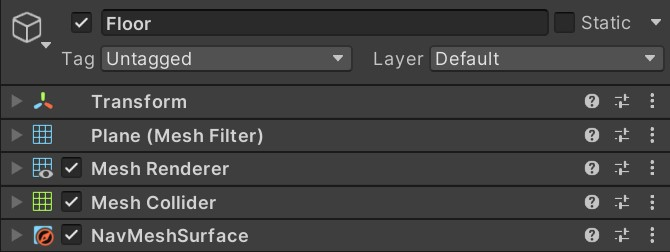

# AI Behaviour Tree

This repository contains a Behaviour Tree tool for Unity, expanded from the one created by **TheKiwiCoder** in [this video](), whose repository you can find [here](https://github.com/thekiwicoder0/UnityBehaviourTreeEditor).

If you don't know what a Behavior Tree is, I suggest you Google it first.

> [!NOTE]
> The minimum version currently supported is **Unity 2022.2**

> [!IMPORTANT]
> Este proyecto se encuentra en una fase de desarrollo temprana, por lo que es posible que encuentres errores y **NO** se recomienda su uso en producción.

## Goal

Como seguramente ya saben, hoy en día existen diferentes herramientas de Behaviour Tree para Unity tanto en GitHub como en la tienda de Unity, y aunque suelen ser increíblemente flexibles, sus interfaces tienden a alejarse de la forma en que Unity crea las suyas, resultando poco intuitivas a primera vista.

Este proyecto trata de cambiar eso entregando una interfaz similar a la de Unity, resultando en una herramienta simple, flexible e intuitiva.

## Table of Contents

1. [Features](#features)
2. [Installation](#installation)
3. [Getting Started](#getting-started)
    1. [Graph](#graph)
        - [Navigation](#navigation)
        - [Shortcuts](#shortcuts)
        - [Adding Nodes](#adding-nodes)
    2. [Runner](#runner)

## Features

- Graph Node Editor
- Blackboard Editor
- Blackboard Overrides
- Runtime Debugger

## Installation

First of all, we need to install a dependency called **METools**.

Open your Unity project, go to `Window > Package Manager` and click the `+` dropdown on the **top-left** corner, then select `Add package from git URL...` and paste the following URL:

```
https://github.com/MoshitinEncoded/METools.git
```

> [!NOTE]
> If you receive the error `No 'git' executable was found` you're likely missing a **git** installation. You can install **git** from here: https://git-scm.com/download/win

Once installed, do the same with this package:

```
https://github.com/MoshitinEncoded/AI-Behaviour-Tree.git
```

## Getting Started

AI Behaviour Tree está compuesto principalmente de un **ScriptableObject** llamado `BehaviourTree` y un **MonoBehaviour** llamado `BehaviourTreeRunner`.

Al igual que el `Animator` de Unity, el **ScriptableObject** contiene el comportamiento mientras que el **MonoBehaviour** se encarga de ejecutarlo. Comencemos creando un `BehaviourTree` en nuestro proyecto.

1. Ve a tu ventana de proyecto y haz clic derecho para abrir el menú contextual o haz clic en el botón `+` en la esquina superior izquierda.
2. Selecciona `Crear > AI > BehaviourTree` y elige un nombre.
3. Haz doble clic sobre el **ScriptableObject** para poder editarlo.

Verás que ha aparecido una nueva ventana, agrándala y veamos qué tiene.


*A blank BehaviourTree graph.*

Deberías ver algo como esto. Como puedes ver es súper simple, por un lado tenemos el **Grafo** y por el otro el **Blackboard**.

### Graph

El grafo contiene el árbol de nodos y sus conexiones. Al principio solo tendrás un nodo por defecto llamado `Root`, el cual no puede ser copiado ni eliminado.

El árbol comienza su ejecución a través del `Root` y luego parte hacia el resto de nodos. Cuando los nodos devuelven su estado al `Root`, finaliza la ejecución del árbol de ese frame.

Solo existen 3 estados que un nodo puede devolver: `Success`, `Running` o `Failure`. 

> [!NOTE]
> Ten en cuenta que si el `Root` recibe el estado `Success` o `Failure`, frenará la ejecución del árbol por completo y deberás reiniciarlo manualmente.

#### Navigation

| Action               | Control             |
| -------------------- | ------------------- |
| Pan                  | Middle-Click + Drag |
| Zoom                 | Mouse wheel scroll  |
| Select               | Left-Click          |
| Rect Select          | Left-Click + Drag   |
| Drag Selection       | Left-Click + Drag (over node)|
| Add/Remove Selection | Ctrl + Left-Click   |
| Open Contextual Menu | Right-Click         |

#### Shortcuts
| Action               | Shortcut            |
| -------------------- | ------------------- |
| Delete               | Del                 |
| Copy                 | Ctrl + C            |
| Paste                | Ctrl + V            |
| Duplicate            | Ctrl + D            |
| Focus Selection      | F                   |
| Focus All            | A                   |
| Create Node          | Spacebar            |


#### Adding Nodes

Haz clic derecho sobre el grafo y selecciona `Crear Nodo` o presiona la tecla `Espacio` en tu teclado para abrir la ventana de búsqueda. 

Aquí puedes ver los diferentes tipos de nodos a tu disposición: `Task`, `Decorator` y `Composite`.
Puedes buscar los nodos a mano o escribir el nombre en la barra de búsqueda.

Por el momento, vamos a añadir 2 nodos: `Repeater` y `Log Message`.

Conecta los nodos de la siguiente forma:


Luego selecciona el nodo `Log Message` y escribe algún bonito mensaje :)


Perfecto! Esto nos mostrará un mensaje por consola cada vez que se ejecute el BehaviourTree. Vamos a implementarlo!

> [!IMPORTANT]
> El BehaviourTree no se guarda automáticamente, asi que asegúrate de guardar cada tanto.

### Runner

Ahora que tenemos el `BehaviourTree` listo para usar, es hora de ponerlo en marcha. Para ello crearemos un GameObject en la escena y le agregaremos el componente `BehaviourTreeRunner`. Luego, debemos asignarle el `BehaviourTree` que acabamos de crear.

<figure>
    
    <figcaption>The BehaviourTreeRunner with its BehaviourTree setted.</figcaption>
</figure>

Listo! Dale a `Play` y veamos qué pasa.

Si te apareció el mensaje que escribiste por consola repetidas veces, felicidades, quiere decir que funciona! Pero seamos realistas, no instalaste este paquete para imprimir cosas por consola. Es hora de crear una IA!

### Creating an AI

Nuestra IA tendrá un comportamiento sencillo: detectar si el jugador está cerca y perseguirlo. De lo contrario, quedarse en su lugar.

#### Scene

Comencemos preparando la escena:

1. Add a Plane named "Floor" with the `NavMeshSurface` component and bake it.
2. Agrega una cápsula de nombre "Player" con los siguientes componentes:
    1. `Rigidbody` (con "Kinematic" habilitado y "UseGravity" deshabilitado)
    2. `NavMeshModifier` (con "Mode: Remove Object")
3. Ponle el tag "Player" al Player, así podremos identificarlo más tarde.
4. Agrega una Cápsula de nombre "Enemy" con un componente `NavMeshAgent`.



*The Floor inspector.*


*The Player inspector.*


*The Enemy inspector.*

Ahora mismo el Player y el Enemy se ven idénticos. Para que sea más fácil distinguirlos, le añadiremos un material rojo al enemigo:


*The new Hierarchy and Scene.*

Perfecto! Ahora solo nos queda un preparativo más, debemos crear un script que detecte cuándo el Player se encuentra cerca de nuestro enemigo. Para no aburrirlos, aquí les dejo el script que necesitan (solo usen sus habilidades legendarias de copiar y pegar):

```CSharp
using System.Collections.Generic;

using UnityEngine;

public class SimpleSensor : MonoBehaviour
{
    [SerializeField] private string _TargetTag;
    [SerializeField] private Transform _Target;

    public Transform Target => _Target;

    private void OnTriggerEnter(Collider other)
    {
        if (other.CompareTag(_TargetTag) && !_Target)
        {
            _Target = other.transform;
        }
    }

    private void OnTriggerExit(Collider other)
    {
        if (other.transform == _Target)
        {
            _Target = null;
        }
    }
}
```

Una vez que lo tengan:

1. Agreguen un nuevo GameObject llamado "Sensor" como hijo del GameObject "Enemy".
1. Agrégenle un `SphereCollider` con "Is Trigger" habilitado y "Radius" a 5.
2. Agréguenle el script que acabamos de crear con "Target Tag" seteado a "Player".


*The Sensor inspector.*

Primero que nada, crea un nuevo `BehaviourTree` llamado `Enemy` en el que desarrollaremos nuestra IA.


Para esto necesitaremos crear nuestros propios nodos, asi que vamos con ello.

#### Creating Nodes

Crear un nuevo nodo es muy simple, solo tienes que crear un script que herede de una **clase de nodo** y agregar el atributo `CreateNodeMenu` encima de la clase.

Por el momento hay 3 clases de nodo de las cuales puedes heredar: `CompositeNode`, `DecoratorNode` y `TaskNode`, siendo ésta última donde podrás implementar la lógica de las IA.

> [!NOTE]
> Si el compilador no encuentra las clases de nodo, asegúrate de importar estos `namespace` al inicio de tu script
> ```CSharp
> using MoshitinEncoded.AI;
> using MoshitinEncoded.AI.BehaviourTreeLib;
> ```

Para nuestra IA vamos a necesitar 3 nodos que hereden de `TaskNode` llamados `IsTargetAtSightNode`, `FollowTargetNode` y `StopAgentNode`. Comencemos creando el `TargetAtSightNode`.

1. Crea un script llamado `TargetAtSightNode`.
2. Haz que herede de `TaskNode`.
3. Implementa la clase abstracta.
4. Agrégale el atributo `CreateNodeMenu` a la clase.

Notarás que el atributo te pedirá un **string** llamado `path`, éste representa el submenú en el que aparecerá cuando intentes añadir un nodo al grafo. Para este ejercicio le pondremos *"Task/Condition/Is Target at Sight"*.

Debería quedarte de la siguiente forma:

```CSharp
using MoshitinEncoded.AI;
using MoshitinEncoded.AI.BehaviourTreeLib;

[CreateNodeMenu(path: "Task/Condition/Is Target at Sight")]
public class IsTargetAtSightNode : TaskNode
{
    protected override NodeState Run(BehaviourTreeRunner runner)
    {
        throw new System.NotImplementedException();
    }
}
```

> [!NOTE]
> Opcionalmente, también puedes agregarle una descripción al nodo con el atributo `Tooltip` encima de la clase.